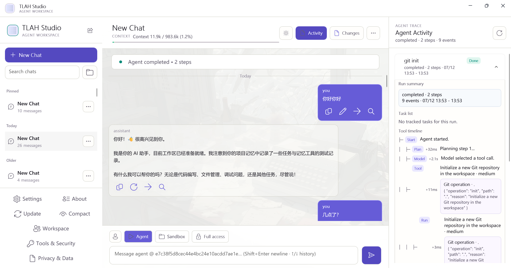
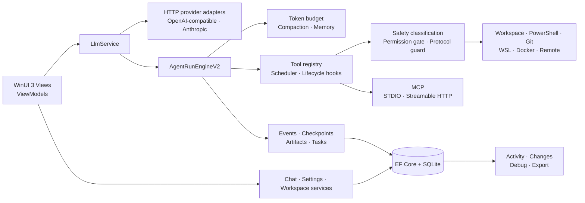

<p align="center">
  
</p>

<h1 align="center">TLAH Studio</h1>

<p align="center">
  <strong>可观测、可控制的 Windows 原生 AI 智能体工作台。</strong><br>
  在一个桌面应用中完成聊天、工具执行、MCP、工作区审阅、模型调试与持久化运行追踪。
</p>

<p align="center">
  <a href="./README.md">English</a> ·
  <a href="https://github.com/24373054/TLAH-Studio/releases/latest">最新版本</a> ·
  <a href="https://download.matrixlabs.cn">下载安装</a> ·
  <a href="./docs/README.md">项目文档</a>
</p>

<p align="center">
  <a href="https://github.com/24373054/TLAH-Studio/actions/workflows/ci.yml"></a>
  <a href="https://github.com/24373054/TLAH-Studio/releases/latest"></a>
  <a href="https://github.com/24373054/TLAH-Studio/releases"></a>
  <a href="https://github.com/24373054/TLAH-Studio/stargazers"></a>
  <a href="https://github.com/24373054/TLAH-Studio/forks"></a>
  
  
  <a href="./LICENSE"></a>
</p>

<p align="center">
  <a href="https://github.com/24373054/TLAH-Studio/releases/latest"><strong>下载最新 Windows x64 版本 →</strong></a>
</p>



> 官方版本支持 Windows 10 build 19041+ 与 Windows 11 x64。安装包已包含运行时，按用户安装，无需管理员权限。

## 为什么选择 TLAH Studio

TLAH Studio 面向那些不能只靠聊天框完成的工作。它让智能体执行过程保持可见，为每个会话提供明确的工作区与权限边界，并持久化理解长任务执行结果所需的构件和记录。

| 原生体验 | 全程可观测 | 权限可控制 | 能力可扩展 |
|---|---|---|---|
| WinUI 3 桌面外壳，提供 Windows 原生输入、主题与窗口行为 | 智能体步骤、工具调用、检查点、构件、模型原始载荷与调试追踪 | 每次询问、仅规划、自动批准、完全访问与推理强度相互独立 | OpenAI-compatible、Anthropic 协议，MCP、Skills 与受信任本地插件清单 |

应用采用本地优先设计，但并非完全离线：聊天与运行记录持久化在本机；只有在用户配置或调用模型提供商、MCP 服务器、网页/HTTP 工具、远程执行或更新服务时，提示词或工具数据才会离开设备。

## 产品亮点

| 领域 | 已实现能力 |
|---|---|
| **智能体运行时** | 多步执行、取消、暂停/恢复、检查点、构件、任务、停止记录与 Activity 回放 |
| **工作区工具** | 文件与代码操作、Git、PowerShell 执行、私有会话沙箱与 Changes 变更审阅 |
| **推理与权限** | 独立的 `Auto / Off / Low / Medium / High / Max` 推理控制与四种工具权限模式 |
| **模型与 MCP** | Anthropic 和 OpenAI-compatible HTTP 协议；支持 STDIO 与 Streamable HTTP 的 MCP 工具/资源 |
| **上下文与记忆** | Token 预算、响应式压缩、项目/会话记忆、大型工具输出持久化与斜杠命令 |
| **可调试性** | 经过敏感信息脱敏的模型请求/响应、运行事件、诊断导出与本地审计数据 |
| **桌面体验** | 明暗主题、响应式右侧工作台、长会话虚拟化、设置搜索、声音与减少动态效果支持 |
| **自动更新** | ECDSA 签名更新元数据、SHA-256 安装包校验、灰度发布、最低版本与原子部署 |

### 执行控制

| 控制项 | 选项 | 用途 |
|---|---|---|
| 工具权限 | 每次询问 · 仅规划 · 自动批准 · 完全访问 | 决定工具何时可以读取、写入、执行或访问宿主机 |
| 推理强度 | Auto · Off · Low · Medium · High · Max | 独立于权限选择模型的推理深度 |
| 工作区 | 指定文件夹 · 私有沙箱 | 限定每个会话的文件、Git 与命令操作范围 |

`完全访问` 可以访问宿主机和网络。受限执行依赖策略与后端，并不等同于虚拟机安全边界。请只使用可信工作区，并在批准前审阅工具请求。

## 项目概况

| 指标 | 当前仓库状态 |
|---|---:|
| 稳定版本 | `4.12.0` |
| 已注册智能体工具 | `44` |
| 内置 Skills | `12` |
| 自动化测试用例 | `308` |
| 测试文件 | `31` |
| MCP 传输方式 | STDIO + Streamable HTTP |
| 官方产物 | Windows x64 自包含安装包 |

实时仓库数据：

[](https://github.com/24373054/TLAH-Studio/stargazers)
[](https://github.com/24373054/TLAH-Studio/forks)
[](https://github.com/24373054/TLAH-Studio/releases)

## 架构



主要依赖方向为 `App → Core + Data`、`Data → Core`、`Tests → Core + Data`。Core 负责编排与服务契约，Data 负责 EF Core 配置和 SQLite 初始化。运行时、持久化、工具安全与更新流程详见[架构文档](./docs/ARCHITECTURE.md)。

## 技术栈

| 组件 | 版本 / 用途 |
|---|---|
| .NET SDK | `8.0.407`，允许滚动到已安装的最新 8.0 feature band |
| Windows App SDK | `2.1.3` / WinUI 3 桌面外壳 |
| CommunityToolkit.Mvvm | `8.4.0` |
| Entity Framework Core | `8.0.28` |
| SQLite | 本地嵌入式持久化 |
| xUnit / coverlet | `2.5.3` / `6.0.0` |
| Inno Setup | 用户级 x64 安装包 |

## 安装

1. 打开[最新版本](https://github.com/24373054/TLAH-Studio/releases/latest)或[官方下载页](https://download.matrixlabs.cn)。
2. 下载 Windows x64 的 `TLAHStudioSetup-<version>.exe`。
3. 运行安装程序，打开 **Settings → Connection**，配置 Anthropic 或 OpenAI-compatible 端点、模型与 API Key。
4. 选择工作区文件夹或继续使用私有沙箱，设置推理强度与权限模式，然后开始会话。

当前 Authenticode 证书为自签名证书，因此即使安装包已经签名，Windows 仍可能显示“不受信任的发布者”。版本完整性还由 ECDSA 签名元数据与公开 SHA-256 摘要共同保护。详见[发布与签名](./docs/RELEASING.md)。

## 从源码构建

### 环境要求

- Windows 10 build 19041+ 或 Windows 11
- [.NET 8 SDK](https://dotnet.microsoft.com/download/dotnet/8.0)
- Visual Studio 2022 与 Windows App SDK / WinUI 工作负载，用于 F5 和 XAML 热重载
- PowerShell 7、Inno Setup 6 与 Windows SDK SignTool 仅在签名发布时需要

```powershell
git clone https://github.com/24373054/TLAH-Studio.git
cd TLAH-Studio

dotnet restore .\TLAHStudio.sln
dotnet build .\TLAHStudio.App\TLAHStudio.App.csproj -c Debug -p:Platform=x64
dotnet test .\TLAHStudio.Core.Tests\TLAHStudio.Core.Tests.csproj -c Release
.\tools\ci.ps1 -Configuration Release -Platform x64
```

使用 Visual Studio 打开 `TLAHStudio.sln`，启动 `TLAHStudio.App` 进行桌面调试。提交改动前请阅读[开发指南](./docs/DEVELOPMENT.md)与[贡献指南](./CONTRIBUTING-CN.md)。

## 仓库结构

```text
TLAHStudio.App/          WinUI 外壳、Views、ViewModels、动效与资源
TLAHStudio.Core/         智能体运行时、模型、工具、MCP、上下文与安全
TLAHStudio.Data/         EF Core 模型、SQLite 初始化与前向迁移
TLAHStudio.Updater/      独立更新辅助程序
TLAHStudio.Installer/    Inno Setup 与签名发布元数据
TLAHStudio.Core.Tests/   xUnit 回归与发布测试
tools/                   CI、签名、验证和部署脚本
docs/                    当前指南与归档设计记录
deploy/download-page/    下载站点资源与服务配置
```

## 安全与数据边界

- API Key 使用 Windows DPAPI 支持的保护机制，并从诊断载荷中脱敏。
- 会话、设置、运行历史与审计记录默认存储在本地 SQLite。
- 模型提示词/响应会发送到用户选择的端点；使用网页、HTTP、MCP、远程执行与更新能力时也会与外部服务通信。
- 工具请求会经过安全分类和权限门控，但 `完全访问` 会按设计放宽这些限制。
- 安全问题应通过 [GitHub 私密漏洞报告](https://github.com/24373054/TLAH-Studio/security/advisories/new)提交，不要创建公开 Issue。

处理敏感工作区之前，请阅读 [SECURITY.md](./SECURITY.md) 与[隐私和数据流](./docs/PRIVACY.md)。

## 文档

| 文档 | 用途 |
|---|---|
| [文档索引](./docs/README.md) | 当前指南、路线图和历史设计记录 |
| [架构](./docs/ARCHITECTURE.md) | 运行时、持久化、工具、MCP 与更新拓扑 |
| [开发](./docs/DEVELOPMENT.md) | 环境配置、命令、规范与测试 |
| [发布与签名](./docs/RELEASING.md) | 版本同步、CI、签名、验证与部署 |
| [隐私和数据流](./docs/PRIVACY.md) | 本地存储和外部传输边界 |
| [更新日志](./CHANGELOG.md) | 面向用户的版本历史 |
| [支持](./SUPPORT.md) | 使用问题、Bug 报告与诊断信息 |

## 参与贡献

欢迎提交 Issue 和范围明确的 Pull Request。请先阅读[英文贡献指南](./CONTRIBUTING.md)或[中文贡献指南](./CONTRIBUTING-CN.md)，运行完整 CI 质量门，并为可见的 WinUI 改动附上截图。所有参与者都应遵守[行为准则](./CODE_OF_CONDUCT.md)。

本仓库公开可见，但采用专有、源码可见许可，并不构成开源授权。使用或再分发代码前请阅读 [LICENSE](./LICENSE)。第三方组件继续遵循各自条款，详见 [THIRD-PARTY-NOTICES.md](./THIRD-PARTY-NOTICES.md)。

## 致谢

TLAH Studio 基于 .NET、Windows App SDK、CommunityToolkit、Entity Framework Core、SQLite、xUnit、TextMate grammars 以及第三方声明中列出的其他项目构建。

<p align="center">
  版权所有 © 2026 北京刻熵科技有限责任公司。保留所有权利。
</p>
