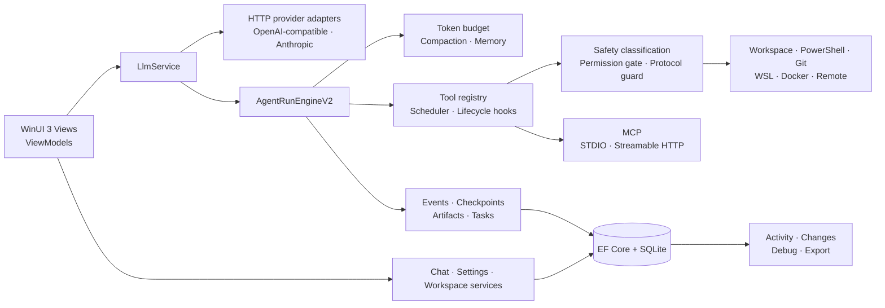

<p align="center">
  
</p>

<h1 align="center">TLAH Studio</h1>

<p align="center">
  <strong>A native Windows workspace for observable, controllable AI agents.</strong><br>
  Chat, tool execution, MCP, workspace review, provider debugging, and durable run history in one desktop app.
</p>

<p align="center">
  <a href="./README-CN.md">简体中文</a> ·
  <a href="https://github.com/24373054/TLAH-Studio/releases/latest">Latest release</a> ·
  <a href="https://download.matrixlabs.cn">Download</a> ·
  <a href="./docs/README.md">Documentation</a>
</p>

<p align="center">
  <a href="https://github.com/24373054/TLAH-Studio/actions/workflows/ci.yml"></a>
  <a href="https://github.com/24373054/TLAH-Studio/releases/latest"></a>
  <a href="https://github.com/24373054/TLAH-Studio/releases"></a>
  <a href="https://github.com/24373054/TLAH-Studio/stargazers"></a>
  <a href="https://github.com/24373054/TLAH-Studio/forks"></a>
  
  
  <a href="./LICENSE"></a>
</p>

<p align="center">
  <a href="https://github.com/24373054/TLAH-Studio/releases/latest"><strong>Download the latest Windows x64 release →</strong></a>
</p>


> The official build targets Windows 10 build 19041+ and Windows 11 on x64. It is self-contained and installs per user without administrator privileges.

## Why TLAH Studio

TLAH Studio is designed for work that needs more than a chat box. It keeps agent execution visible, gives each conversation an explicit workspace and permission boundary, and records the artifacts needed to understand what happened after a long run.

| Native | Observable | Controlled | Extensible |
|---|---|---|---|
| WinUI 3 desktop shell with Windows-native input, theming, and window behavior | Agent steps, tool calls, checkpoints, artifacts, raw provider payloads, and debug traces | Ask, Plan, Auto approve, and Full access are separate from reasoning effort | OpenAI-compatible and Anthropic protocols, MCP, skills, and trusted local plugin manifests |

The app is local-first, not offline-only: chats and run records are persisted locally, while prompts or tool data leave the device only through providers, MCP servers, web/HTTP tools, remote execution, or update endpoints that the user configures or invokes.

## Product highlights

| Area | What is included |
|---|---|
| **Agent runtime** | Multi-step execution, cancellation, pause/resume, checkpoints, artifacts, tasks, stop records, and Activity replay |
| **Workspace tooling** | File and code operations, Git, PowerShell execution, private chat sandboxes, and a Changes review surface |
| **Reasoning and permissions** | Independent `Auto / Off / Low / Medium / High / Max` reasoning controls plus four tool permission modes |
| **Providers and MCP** | Anthropic and OpenAI-compatible HTTP protocols; MCP over STDIO and Streamable HTTP with tools and resources |
| **Context and memory** | Token budgeting, reactive compaction, project/session memory, persistent large tool outputs, and slash commands |
| **Debuggability** | Secret-redacted provider request/response capture, run events, diagnostics export, and local audit data |
| **Desktop experience** | Light/dark themes, responsive right workbench, virtualized long conversations, settings search, sounds, and reduced-motion support |
| **Updates** | ECDSA-signed update metadata, SHA-256 installer verification, staged rollout, minimum-version enforcement, and atomic deployment |

### Execution controls

| Control | Options | Purpose |
|---|---|---|
| Tool permissions | Ask each time · Plan only · Auto approve · Full access | Defines when tools may read, write, execute, or access the host |
| Reasoning effort | Auto · Off · Low · Medium · High · Max | Selects model reasoning depth independently of permissions |
| Workspace | Selected folder · Private sandbox | Contains file, Git, and command operations for each chat |

`Full access` can reach the host and network. Restricted execution is policy- and backend-based; it is not a VM security boundary. Use trusted workspaces and review tool requests before approval.

## Project snapshot

| Metric | Current repository state |
|---|---:|
| Stable release | `4.12.0` |
| Registered agent tools | `44` |
| Bundled skills | `12` |
| Automated test cases | `307` |
| Test files | `31` |
| MCP transports | STDIO + Streamable HTTP |
| Official artifact | Windows x64, self-contained installer |

Live repository activity:

[](https://github.com/24373054/TLAH-Studio/stargazers)
[](https://github.com/24373054/TLAH-Studio/forks)
[](https://github.com/24373054/TLAH-Studio/releases)

## Architecture



The primary dependency direction is `App → Core + Data`, `Data → Core`, and `Tests → Core + Data`. Core owns orchestration and service contracts; Data owns EF Core configuration and SQLite initialization. See [Architecture](./docs/ARCHITECTURE.md) for runtime, persistence, tool-safety, and update flows.

## Technology

| Component | Version / role |
|---|---|
| .NET SDK | `8.0.407`, rolling to the latest installed 8.0 feature band |
| Windows App SDK | `2.1.3` / WinUI 3 desktop shell |
| CommunityToolkit.Mvvm | `8.4.0` |
| Entity Framework Core | `8.0.28` |
| SQLite | Local embedded persistence |
| xUnit / coverlet | `2.5.3` / `6.0.0` |
| Inno Setup | User-level x64 installer |

## Install

1. Open the [latest release](https://github.com/24373054/TLAH-Studio/releases/latest) or the [official download page](https://download.matrixlabs.cn).
2. Download `TLAHStudioSetup-<version>.exe` for Windows x64.
3. Run the installer, open **Settings → Connection**, and configure an Anthropic or OpenAI-compatible endpoint, model, and API key.
4. Select a workspace folder or keep the private sandbox, choose reasoning and permission modes, then start a chat.

The current Authenticode certificate is self-signed. Windows may show an untrusted-publisher warning even though the installer is signed. Release integrity is also protected by ECDSA-signed metadata and the published SHA-256 digest. See [Release and signing](./docs/RELEASING.md).

## Build from source

### Requirements

- Windows 10 build 19041+ or Windows 11
- [.NET 8 SDK](https://dotnet.microsoft.com/download/dotnet/8.0)
- Visual Studio 2022 with the Windows App SDK / WinUI workload for F5 and XAML Hot Reload
- PowerShell 7, Inno Setup 6, and Windows SDK SignTool only for signed release builds

```powershell
git clone https://github.com/24373054/TLAH-Studio.git
cd TLAH-Studio

dotnet restore .\TLAHStudio.sln
dotnet build .\TLAHStudio.App\TLAHStudio.App.csproj -c Debug -p:Platform=x64
dotnet test .\TLAHStudio.Core.Tests\TLAHStudio.Core.Tests.csproj -c Release
.\tools\ci.ps1 -Configuration Release -Platform x64
```

Open `TLAHStudio.sln` in Visual Studio and launch `TLAHStudio.App` for desktop debugging. See [Development guide](./docs/DEVELOPMENT.md) and [Contributing](./CONTRIBUTING.md) before submitting a change.

## Repository layout

```text
TLAHStudio.App/          WinUI shell, views, view models, motion, and assets
TLAHStudio.Core/         Agent runtime, providers, tools, MCP, context, security
TLAHStudio.Data/         EF Core model, SQLite initialization, forward migrations
TLAHStudio.Updater/      Standalone update helper
TLAHStudio.Installer/    Inno Setup and signed release metadata
TLAHStudio.Core.Tests/   xUnit regression and release tests
tools/                   CI, signing, verification, and deployment scripts
docs/                    Current guides plus archived design records
deploy/download-page/    Download site assets and service configuration
```

## Security and data boundary

- API keys use Windows DPAPI-backed protection and are redacted from diagnostic payloads.
- Conversations, settings, run history, and audit records are stored in local SQLite by default.
- Provider prompts/responses are transmitted to the endpoint selected by the user; web, HTTP, MCP, remote execution, and update operations also communicate externally when used.
- Tool requests pass through safety classification and permission gates, but `Full access` intentionally relaxes those restrictions.
- Security reports should use [GitHub Private Vulnerability Reporting](https://github.com/24373054/TLAH-Studio/security/advisories/new), not a public issue.

Read [SECURITY.md](./SECURITY.md) and [Privacy and data flows](./docs/PRIVACY.md) before using sensitive workspaces.

## Documentation

| Document | Purpose |
|---|---|
| [Documentation index](./docs/README.md) | Current guides, roadmap, and historical design records |
| [Architecture](./docs/ARCHITECTURE.md) | Runtime, persistence, tool, MCP, and update topology |
| [Development](./docs/DEVELOPMENT.md) | Environment setup, commands, conventions, and testing |
| [Release and signing](./docs/RELEASING.md) | Version synchronization, CI, signing, verification, and deployment |
| [Privacy and data flows](./docs/PRIVACY.md) | Local storage and external transmission boundaries |
| [Changelog](./CHANGELOG.md) | User-visible release history |
| [Support](./SUPPORT.md) | Questions, bug reports, and diagnostics |

## Contributing

Issues and focused pull requests are welcome. Start with [CONTRIBUTING.md](./CONTRIBUTING.md) (or [中文贡献指南](./CONTRIBUTING-CN.md)), run the full CI gate, and include screenshots for visible WinUI changes. Please follow the [Code of Conduct](./CODE_OF_CONDUCT.md).

This is a publicly visible, proprietary source repository rather than an open-source grant. See [LICENSE](./LICENSE) before using or redistributing the code. Third-party components remain under their respective terms; see [THIRD-PARTY-NOTICES.md](./THIRD-PARTY-NOTICES.md).

## Acknowledgements

TLAH Studio is built on .NET, Windows App SDK, CommunityToolkit, Entity Framework Core, SQLite, xUnit, TextMate grammars, and other projects listed in the third-party notices.

<p align="center">
  Copyright © 2026 Beijing Ke Entropy Technology Co., Ltd. All rights reserved.
</p>
