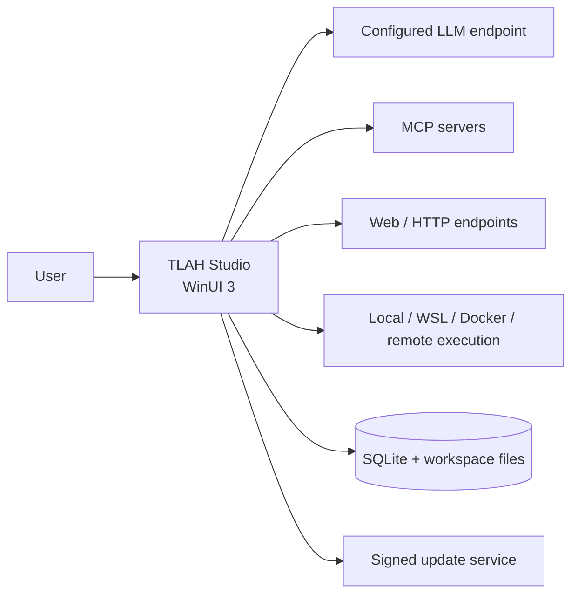
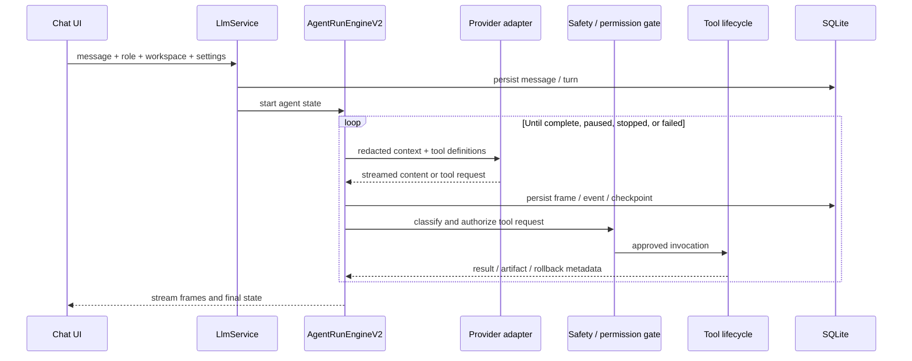
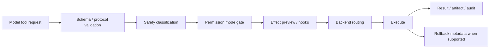

# Architecture

Verified against TLAH Studio 4.12.0.

## System Context

TLAH Studio is an unpackaged WinUI 3 desktop application. The UI, agent orchestration, local persistence, updater, installer, and download metadata live in one .NET solution, while model providers, MCP servers, and optional execution backends remain external.



## Solution Boundaries

| Project | Responsibility |
|---|---|
| `TLAHStudio.App` | Window shell, views, view models, dependency injection, interaction/motion, and packaged assets |
| `TLAHStudio.Core` | Domain models, provider adapters, `LlmService`, agent engine, context, tools, safety, MCP, memory, privacy, and update services |
| `TLAHStudio.Data` | EF Core model configuration, SQLite initialization, and lightweight forward migrations |
| `TLAHStudio.Updater` | Standalone helper that waits for the app, invokes the installer, and relaunches |
| `TLAHStudio.Core.Tests` | Unit, integration-style SQLite, runtime, tool, privacy, and release regression tests |

Dependency direction:

```text
App ───────→ Core
 │           ↑
 └──────→ Data
Tests ───→ Core + Data
Updater    (standalone)
```

Core does not reference the Data project, but several Core services depend on EF Core abstractions and a configured `DbContext`; it is an application service layer, not a persistence-free domain kernel.

## Agent Request Flow



`AgentRunEngineV2` owns the multi-step loop and emits typed frames. Activity subscribes to the current run and can reconstruct completed or cancelled runs from persisted events. Large tool outputs can be written under `.tlah_context/tool-results/` instead of retaining full text in memory.

## Tool Lifecycle and Safety

Forty-four `IAgentTool` implementations are registered in the desktop host. They cover plan/user interaction, skills, tasks, file and code operations, Git, command execution, HTTP/web, MCP, and memory.



The restricted local backend uses command, path, protocol, resource, and approval policies. It does not create a hardened OS isolation boundary. WSL and Docker require local installation; remote execution requires an explicitly configured endpoint and credential.

## Context, Memory, and Persistence

- `TlahDbContext` persists chats, messages, turns, provider traces, runs, steps, events, checkpoints, artifacts, tasks, settings, MCP configuration, and audit entries.
- Reactive compaction progressively trims tool output, creates summaries, and finally applies emergency truncation when the token budget requires it.
- Project and session memory are injected as structured runtime context.
- Migrations are forward-only lightweight SQL operations (`CREATE TABLE IF NOT EXISTS`, `ALTER TABLE ADD COLUMN`) rather than standard EF migration bundles.

## Providers, MCP, and Plugins

- Provider adapters directly use `HttpClient` for Anthropic and OpenAI-compatible protocols. Streaming and non-streaming paths share persistence and redaction behavior.
- MCP supports STDIO and Streamable HTTP, including tool discovery/calls and resource list/read.
- Skills may be bundled, user-managed, project-scoped, or activated through trusted local plugin manifests.
- Plugin support currently centers on skills and MCP activation; it should not be treated as a general marketplace or arbitrary managed-code extension boundary.

## Update Flow

```mermaid
flowchart LR
    CHECK[UpdateService] --> META[Download latest.json + versioned signature]
    META --> ECDSA[Verify ECDSA P-256 signature]
    ECDSA --> POLICY[Version / rollout / force policy]
    POLICY --> DOWNLOAD[Download installer]
    DOWNLOAD --> HASH[Verify SHA-256]
    HASH --> HELPER[Start Updater]
    HELPER --> INSTALL[Silent Inno Setup install]
    INSTALL --> RELAUNCH[Relaunch application]
```



Authenticode is a separate executable signature. The current project certificate is self-signed and does not establish a publicly trusted Windows certificate chain.

## Known Architectural Limits

- Official release automation produces Windows x64 artifacts only, even though the app project declares additional runtime identifiers.
- Code diagnostics and symbol discovery are lightweight and do not represent a complete LSP implementation.
- Team/workspace configuration is local; there is no real-time cloud collaboration backend.
- Full access intentionally bypasses most approval restrictions and must be treated as host-level access.
