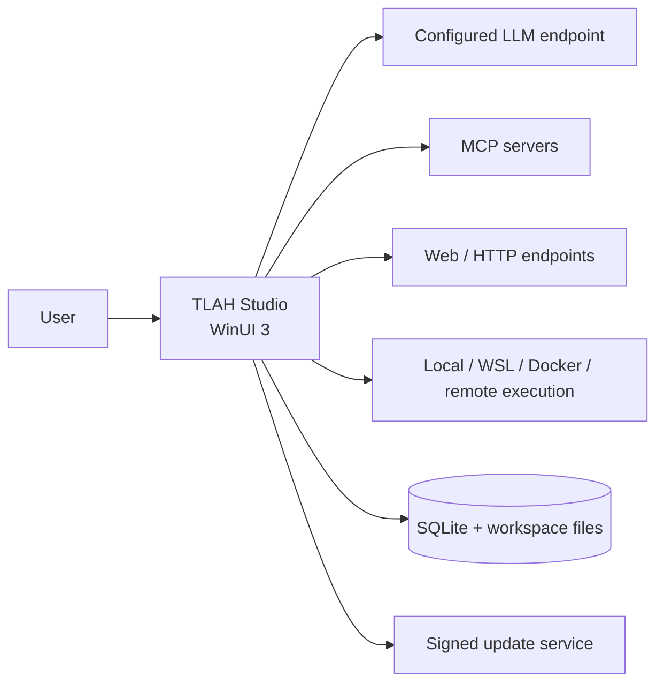
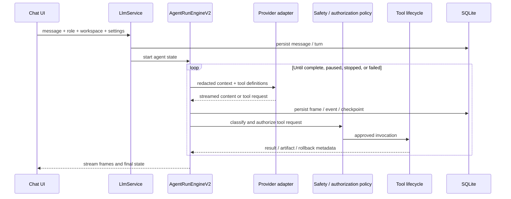
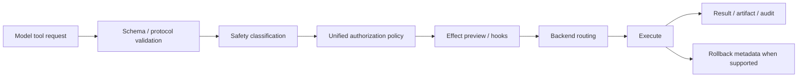
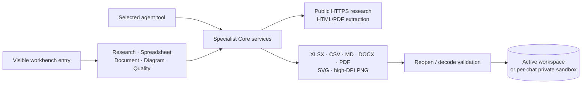

# Architecture

Verified against TLAH Studio 4.15.0.

## System Context

TLAH Studio is an unpackaged WinUI 3 desktop application. The UI, agent orchestration, local persistence, updater, installer, and download metadata live in one .NET solution, while model providers, MCP servers, and optional execution backends remain external.



## Solution Boundaries

| Project | Responsibility |
|---|---|
| `TLAHStudio.App` | Window shell, views, view models, dependency injection, interaction/motion, and packaged assets |
| `TLAHStudio.Core` | Domain models, provider adapters, `LlmService`, agent engine, context, tools, safety, MCP, memory, privacy, and update services |
| `TLAHStudio.Data` | EF Core model configuration, SQLite initialization, and lightweight forward migrations |
| `TLAHStudio.Updater` | Standalone helper that waits for the app, invokes the installer, and relaunches |
| `TLAHStudio.Core.Tests` | Unit, integration-style SQLite, runtime, tool, privacy, and release regression tests |

Dependency direction:

```text
App ───────→ Core
 │           ↑
 └──────→ Data
Tests ───→ Core + Data
Updater    (standalone)
```

Core does not reference the Data project, but several Core services depend on EF Core abstractions and a configured `DbContext`; it is an application service layer, not a persistence-free domain kernel.

## Agent Request Flow



`AgentRunEngineV2` owns the multi-step loop and emits typed frames. Activity subscribes to the current run and can reconstruct completed, paused, or cancelled runs from persisted events. Large tool outputs can be written under `.tlah_context/tool-results/` instead of retaining full text in memory.

## Tool Lifecycle and Safety

Fifty-one `IAgentTool` implementations are registered in the desktop host. They cover plan/user interaction, skills, tasks, file and code operations, Git, command execution, HTTP/web, multi-source research, spreadsheets, documents, diagrams, MCP, and memory.

The registry remains the source of truth, but a deterministic context selector sends no more than 15 initially callable tools on a normal turn. User intent, recent conversation/tool context, failed-tool recovery, and explicit catalog results choose the active subset. Deferred tools remain searchable, and catalog promotion accepts only names present in the live registry.



`ToolAuthorizationPolicy` is the single decision matrix used by planning, approval, resume, lifecycle, and execution boundaries. Safety classification describes an operation; authorization decides whether the current mode may run it, must ask, or must block it.

| Mode | Runtime contract |
|---|---|
| Ask | Safe operations may run immediately. A risky or contextually restricted invocation pauses for a decision; approval authorizes that exact persisted invocation through resume and execution. |
| Plan | Exploration remains read-first; write or destructive operations require approval. |
| Auto approve | Ordinary work runs automatically, while contextual restrictions and sensitive repository/environment/shell paths still require approval. |
| Full access | Ordinary policy denies, host-path boundaries, network allowlists, and sensitive-path prompts are bypassed. Immutable catastrophic operations remain blocked; interaction tools may still pause because they require user input. |

The immutable guard is deliberately narrow: catastrophic root-recursive deletion and disk, boot, or account destruction cannot be approved in any mode. Other high-risk or contextual restrictions remain reviewable instead of becoming accidental permanent blocks. Approval payloads are read-only by default; an explicit edit must parse as a JSON object and pass the selected tool's validator before the persisted invocation changes.

The restricted local backend uses command, path, protocol, resource, and approval policies. It does not create a hardened OS isolation boundary. WSL and Docker require local installation; remote execution requires an explicitly configured endpoint and credential. The default command runtime limit is 120 seconds unless settings or a tool request select another supported value.

## Research and Artifact Workbench

The same specialist services are available through agent tools and the visible **Create & Research** dialog. The expanded sidebar, compact sidebar, composer, and command palette open the dialog directly; no model call, slash command, or JSON is required to start a workflow.



Research supports Quick, Balanced, and Deep modes, domain allow/block lists, recency, language, source limits, independent-domain evidence, conflicts, and partial retrieval failures. Search starts with DuckDuckGo HTML; its adaptive fallback uses GDELT Project for non-language-constrained news or the matching `en`/`zh`/`ja`/`ko`/`de`/`fr` Wikipedia edition for timeless/entity lookup, then DuckDuckGo Lite. Each structured search endpoint gets one bounded attempt: 408/429/5xx, timeout, and network failures fall through to the next provider instead of multiplying tail latency. A GDELT request also activates a local five-second-or-`Retry-After` provider gate across query variants. Wikipedia uses the bounded `list=search` API; `ratelimited` and `maxlag` envelopes fall through immediately. Provider, provider URL, article URL, and applicable CC BY-SA 4.0 attribution survive into evidence, reports, agent source metadata, and the visible result preview. Page-content retrieval retains its independent bounded retry policy. Research permits public HTTPS destinations only and rejects loopback, private, and link-local targets even in Full access.

Artifact writes are workspace-scoped, atomic, conflict-safe by default, and validated after creation. The workbench uses the active workspace or that chat's isolated `%LOCALAPPDATA%\TLAH Studio\sandboxes\<chat>` root, displays the full path, and provides preview/open actions. Agent-created outputs carry path, content type, size, and checksum metadata.

## Long-Run Recovery

- Anthropic and OpenAI-compatible streaming adapters require a terminal marker. A truncated stream is a provider failure, not a successful partial answer.
- HTTP 408/429/5xx responses, network failures, timeouts, empty responses, and incomplete streams receive up to three bounded attempts. The UI stream is reset before a retry so discarded partial text is not duplicated.
- Exhausted transient provider failures persist the latest checkpoint and place the run in `Paused`; resume retains the selected permission mode and continues from durable state.
- A failed tool records a redacted failure summary and invocation signature. The next model step is instructed to change tool, command, arguments, or scope instead of repeating the same call.
- If recovery still produces no viable action, the engine creates an `ask_user_question` choice rather than marking the run complete.
- The normal 48-step budget is a soft boundary. Recent progress or unresolved recovery can extend it by 24 steps at a time up to the 192-step automatic ceiling. Each explicit Resume may add up to 96 further steps with saturating arithmetic; approval completion does not add budget.
- A mutating call whose response is lost after dispatch enters `unknown_outcome`. The persisted invocation is a replay fence: Resume acknowledges it, writes a synthetic result for provider continuity, and moves to a different recovery step without executing the original operation again.

## Context, Memory, and Persistence

- `TlahDbContext` persists chats, messages, turns, provider traces, runs, steps, events, checkpoints, artifacts, tasks, settings, MCP configuration, and audit entries.
- Reactive compaction progressively trims tool output, creates summaries, and finally applies emergency truncation when the token budget requires it.
- Checkpoints include recovery counters, the latest failed invocation signature, permission state, resume count, and adaptive-budget state so reopening cannot erase failure or authorization context.
- Project and session memory are injected as structured runtime context.
- Migrations are forward-only lightweight SQL operations (`CREATE TABLE IF NOT EXISTS`, `ALTER TABLE ADD COLUMN`) rather than standard EF migration bundles.

## Providers, MCP, and Plugins

- Provider adapters directly use `HttpClient` for Anthropic and OpenAI-compatible protocols. Streaming and non-streaming paths share persistence and redaction behavior; streamed responses additionally prove terminal completion before they are accepted. Official OpenAI and Anthropic endpoints receive normalized strict schemas and safe read-only parallel-call hints, while compatible endpoints omit unsupported extensions.
- MCP supports STDIO and Streamable HTTP, including tool discovery/calls and resource list/read.
- Skills may be bundled, user-managed, project-scoped, or activated through trusted local plugin manifests.
- Plugin support currently centers on skills and MCP activation; it should not be treated as a general marketplace or arbitrary managed-code extension boundary.

## Update Flow

```mermaid
flowchart LR
    CHECK[UpdateService] --> META[Download latest.json + versioned signature]
    META --> ECDSA[Verify ECDSA P-256 signature]
    ECDSA --> POLICY[Version / rollout / force policy]
    POLICY --> DOWNLOAD[Download installer]
    DOWNLOAD --> HASH[Verify SHA-256]
    HASH --> HELPER[Start Updater]
    HELPER --> INSTALL[Silent Inno Setup install]
    INSTALL --> RELAUNCH[Relaunch application]
```



Authenticode is a separate executable signature. The current project certificate is self-signed and does not establish a publicly trusted Windows certificate chain.

## Known Architectural Limits

- Official release automation produces Windows x64 artifacts only, even though the app project declares additional runtime identifiers.
- Code diagnostics and symbol discovery are lightweight and do not represent a complete LSP implementation.
- Team/workspace configuration is local; there is no real-time cloud collaboration backend.
- Full access intentionally bypasses ordinary approval and contextual restrictions and must be treated as host-level access; it is not a promise to execute immutable catastrophic operations.
